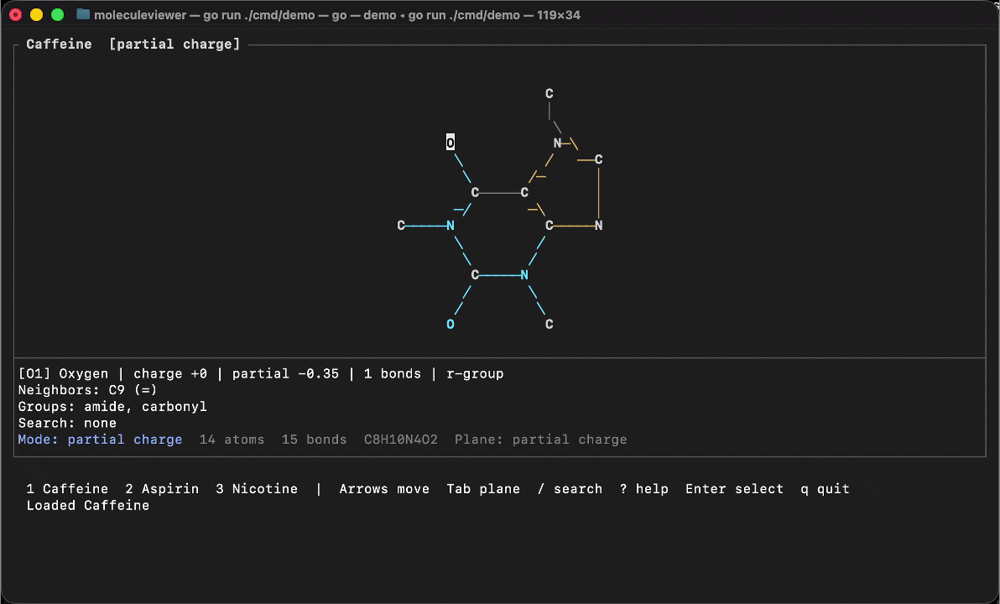
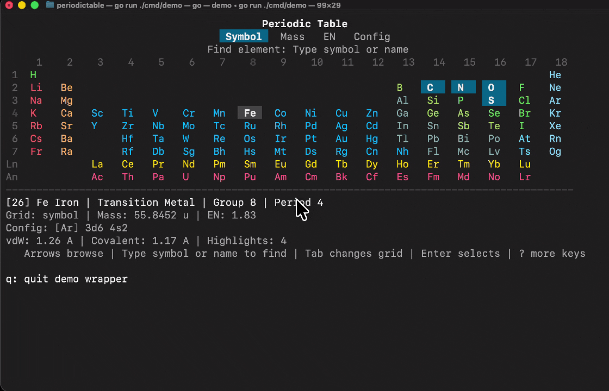
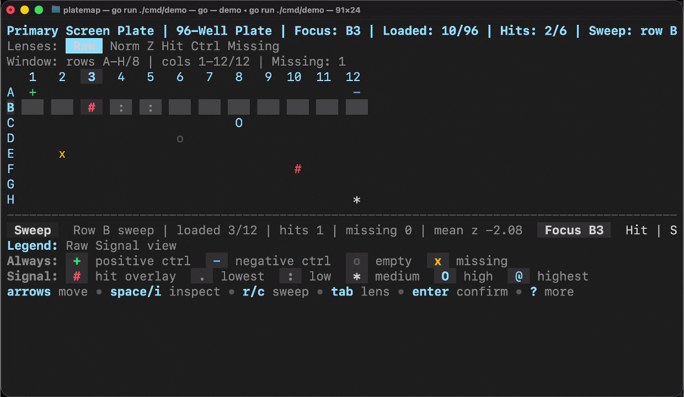
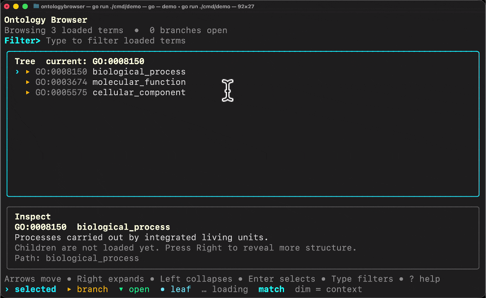

<div align="center">
  <br/>
  <h1>Crust</h1>
  <p><strong>Life sciences components for Bubble Tea.</strong></p>
  <p>Sequences, molecules, plates, ontologies, elements, and variants — rendered natively in the terminal.</p>
  <br/>

  <a href="https://pkg.go.dev/github.com/the-omics-os/crust"></a>&nbsp;
  <a href="https://charm.land/bubbletea"></a>&nbsp;
  <a href="LICENSE"></a>

  <br/><br/>
</div>

---

<br/>

<div align="center">
  
  <br/>
  <sub><strong>SequenceViewer</strong> — property-aware DNA/RNA/protein inspection with view cycling, complement strands, and residue-level analysis.</sub>
</div>

<br/>

## What is Crust?

Crust is a standalone Go component library for **structured biological inspection** in the terminal. Each component is a normal [Bubble Tea v2](https://charm.land/bubbletea) model with typed constructors and functional options — drop any of them into your own TUI application.

```go
import "github.com/the-omics-os/crust/sequenceviewer"

viewer := sequenceviewer.New(
    sequenceviewer.WithSequence("ATGGCTAGCTAGCTAGCTAGC", sequenceviewer.DNA),
    sequenceviewer.WithWidth(80),
    sequenceviewer.WithComplement(true),
)
```

No JSON protocols. No framework lock-in. Just `tea.Model` implementations you can embed, compose, and theme.

<br/>

## Components

<table>
  <thead>
    <tr>
      <th>Component</th>
      <th>Package</th>
      <th>What it does</th>
    </tr>
  </thead>
  <tbody>
    <tr>
      <td><strong>SequenceViewer</strong></td>
      <td><code>sequenceviewer</code></td>
      <td>DNA/RNA/protein display with IUPAC coloring, Clustal amino acid schemes, GC analysis, ORF detection, restriction sites, Tm estimation, and view-switchable property overlays</td>
    </tr>
    <tr>
      <td><strong>MoleculeViewer</strong></td>
      <td><code>moleculeviewer</code></td>
      <td>2D molecular structure from SMILES with Unicode bond rendering, atom navigation, functional-group highlighting, and a focused inspector pane</td>
    </tr>
    <tr>
      <td><strong>PlateMap</strong></td>
      <td><code>platemap</code></td>
      <td>96/384/1536-well assay plates with signal, z-score, and control views, hit calling, row/column sweeps, and replicate awareness</td>
    </tr>
    <tr>
      <td><strong>OntologyBrowser</strong></td>
      <td><code>ontologybrowser</code></td>
      <td>Tree navigation for GO, Reactome, ChEBI, and Disease Ontology with lazy-load children, fuzzy search, and node selection</td>
    </tr>
    <tr>
      <td><strong>PeriodicTable</strong></td>
      <td><code>periodictable</code></td>
      <td>Full 118-element interactive table with category coloring, property views, and a detail panel</td>
    </tr>
    <tr>
      <td><strong>VariantLens</strong></td>
      <td><code>variantlens</code></td>
      <td>Multi-layer variant consequence inspector — nucleotide, codon, amino acid, and feature context aligned in one view</td>
    </tr>
    <tr>
      <td><strong>QCDashboard</strong></td>
      <td><code>qcdashboard</code></td>
      <td>Multi-metric quality panel with pass/warn/fail status bars and configurable thresholds</td>
    </tr>
    <tr>
      <td><strong>ThresholdSlider</strong></td>
      <td><code>thresholdslider</code></td>
      <td>Numeric threshold adjustment with visual bar and live item count feedback</td>
    </tr>
  </tbody>
</table>

<br/>

## Gallery

<div align="center">
  <table>
    <tr>
      <td align="center" width="50%">
        
        <br/><sub><strong>MoleculeViewer</strong> — SMILES to 2D structure with atom navigation</sub>
      </td>
      <td align="center" width="50%">
        
        <br/><sub><strong>PeriodicTable</strong> — 118 elements with category coloring</sub>
      </td>
    </tr>
    <tr>
      <td align="center" width="50%">
        
        <br/><sub><strong>PlateMap</strong> — 96/384-well assay plate inspection</sub>
      </td>
      <td align="center" width="50%">
        
        <br/><sub><strong>OntologyBrowser</strong> — GO/Reactome/ChEBI tree navigation</sub>
      </td>
    </tr>
  </table>
</div>

<br/>

## Install

```bash
go get github.com/the-omics-os/crust@latest
```

Import only what you need:

```go
import (
    "github.com/the-omics-os/crust/sequenceviewer"
    "github.com/the-omics-os/crust/periodictable"
    "github.com/the-omics-os/crust/platemap"
)
```

**Requirements:** Go 1.25+, Charm v2 (`charm.land/bubbletea/v2`, `charm.land/lipgloss/v2`)

<br/>

## Usage

Every component follows the same pattern — functional options, standard `tea.Model` interface, dynamic theming:

```go
package main

import (
    "fmt"
    "os"

    tea "charm.land/bubbletea/v2"
    "github.com/the-omics-os/crust/periodictable"
)

func main() {
    m := periodictable.New(
        periodictable.WithWidth(100),
    )
    p := tea.NewProgram(m)
    if _, err := p.Run(); err != nil {
        fmt.Fprintf(os.Stderr, "error: %v\n", err)
        os.Exit(1)
    }
}
```

<details>
<summary><strong>Run the built-in demos</strong></summary>
<br/>

```bash
go run ./sequenceviewer/cmd/demo/
go run ./moleculeviewer/cmd/demo/
go run ./periodictable/cmd/demo/
go run ./platemap/cmd/demo/
go run ./ontologybrowser/cmd/demo/
go run ./variantlens/cmd/demo/
```
</details>

<br/>

## Design Principles

1. **Standalone `tea.Model`** — every component is a normal Bubble Tea v2 model. Typed constructors, functional options. No protocol coupling.
2. **Build on Bubbles, don't replace them** — viewport for scrolling, textinput for search, key for bindings. Never reimplement solved problems.
3. **Domain-correct** — IUPAC nucleotide colors, Clustal amino acid schemes, standard periodic table categories. Scientific conventions over aesthetics.
4. **Composable** — each component is independently importable. No god package. Pick what you need.
5. **Dynamic theming** — per-component `Theme` struct with `DefaultTheme()` and `WithTheme()`. No hardcoded colors.
6. **Compute-capable** — components carry rich data, not just characters. Residues have chemophysical properties. Analysis runs natively in Go.

<br/>

## Interaction Semantics

All components share a consistent keyboard vocabulary:

| Key | Action |
|-----|--------|
| Arrow keys | Navigate within the current view |
| `Tab` | Cycle view modes / switch panes |
| `Enter` | Confirm / select / expand |
| `Esc` | Exit / dismiss / cancel |
| `?` | Toggle help overlay |

<br/>

## Architecture

Crust is a **library**. It has no opinions about your application architecture.

```
your-app/
  main.go           # Your Bubble Tea program
  ├── uses crust/sequenceviewer
  ├── uses crust/platemap
  └── uses crust/periodictable

crust/              # This repo — standalone components
  sequenceviewer/   # tea.Model + typed constructors
  moleculeviewer/   # tea.Model + SMILES parser + 2D layout
  platemap/         # tea.Model + well grid navigation
  ontologybrowser/  # tea.Model + lazy-load tree
  periodictable/    # tea.Model + 118 elements
  variantlens/      # tea.Model + multi-layer variant inspector
  qcdashboard/      # tea.Model + metric status bars
  thresholdslider/  # tea.Model + numeric adjustment
```

Components signal completion via typed messages (`SubmitMsg`, `CancelMsg`) and accept live data updates through `Set*()` mutators — making them ready for streaming workflows without requiring any protocol layer.

<br/>

## Part of Omics-OS

Crust is the terminal UI layer for the [Omics-OS](https://omics-os.com) ecosystem. [Lobster AI](https://lobsterbio.com) is the first consumer — its `biocomp/` adapter layer wraps Crust components into the agent protocol for interactive multi-omics analysis sessions.

```
Lobster AI (multi-agent system)
  └── lobster-tui/internal/biocomp/   # Adapter layer
        └── wraps Crust components    # JSON → typed constructor → tea.Model
              └── crust/*             # This library
```

You don't need Lobster to use Crust. Any Bubble Tea application can embed these components directly.

<br/>

## Development

```bash
go mod tidy           # Sync dependencies
go build ./...        # Compile all packages
go test ./...         # Run all tests
go vet ./...          # Static analysis
```

<br/>

## Acknowledgements

<table border="0" cellspacing="0" cellpadding="10" style="border: none; background: transparent;">
  <tr>
    <td style="border: none; background: transparent;">
      <a href="https://charm.sh">
        
      </a>
    </td>
    <td style="border: none; background: transparent; vertical-align: middle;">
      Crust exists because of the extraordinary work by <a href="https://charm.sh">Charm</a>. Bubble Tea, Lip Gloss, Bubbles, and the entire Charm v2 stack make terminal UIs a joy to build. Thank you to <a href="https://github.com/meowgorithm">@meowgorithm</a>, <a href="https://github.com/muesli">@muesli</a>, <a href="https://github.com/caarlos0">@caarlos0</a>, <a href="https://github.com/aymanbagabas">@aymanbagabas</a>, <a href="https://github.com/bashbunni">@bashbunni</a>, and every Charm contributor. You changed what terminals can be.
    </td>
  </tr>
</table>

<br/>

---

<div align="center">
  <strong>Life sciences deserve better tools. Even in the terminal.</strong>
  <br/><br/>
  <a href="https://omics-os.com">Omics-OS</a> &nbsp;&middot;&nbsp; <a href="https://lobsterbio.com">Lobster AI</a> &nbsp;&middot;&nbsp; <a href="https://docs.omics-os.com">Docs</a> &nbsp;&middot;&nbsp; <a href="https://github.com/the-omics-os/crust">GitHub</a>
</div>
